# PRAKTIKUM JARKOM MODUL 2 KELOMPOK K18 - 2026

## Anggota Kelompok

| Nama                 | NRP        |
| -------------------- | ---------- |
| Catur Setyo Ragil    | 5027251066 |
| Senna Bagus Harimurti| 5027251106 |

## Ringkasan Implementasi

- Praktikum dikerjakan pada GNS3 menggunakan image docker `ardhptr21/alpinet:latest` dan `ardhptr21/debinet:latest`.
- Prefix IP kelompok: `192.220.0.0/16`, domain internal: `k18.com`.
- Semua script konfigurasi diletakkan di `/root` tiap node dan diarsipkan pada folder `scripts/` repo ini.

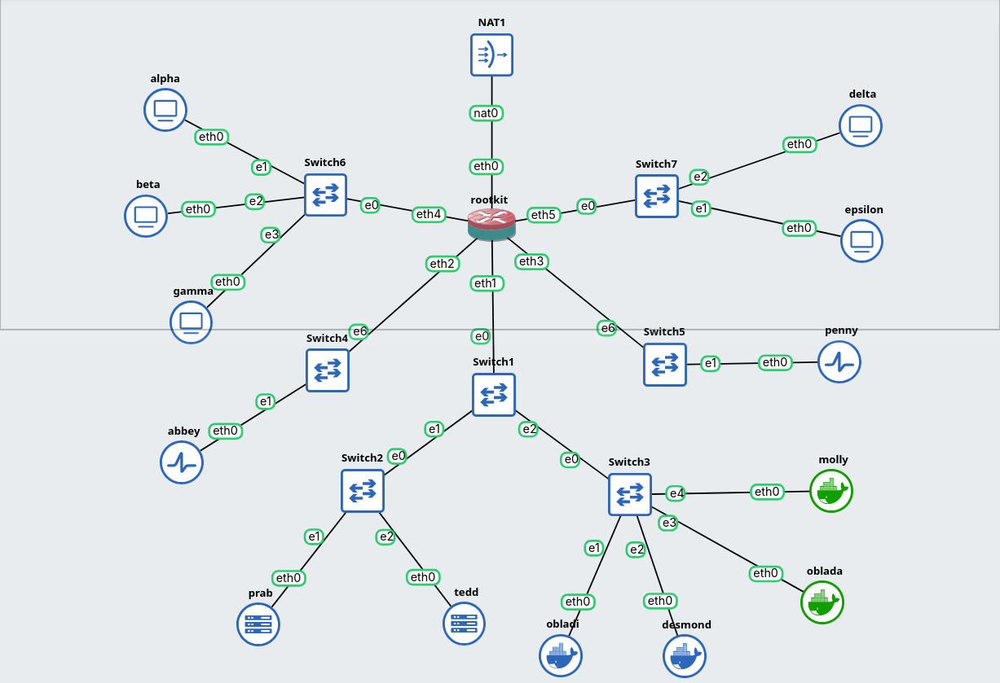

---

## Laporan

### Soal 1

Rootkit memakai enam interface: `eth0` ke NAT (WAN) dan `eth1`–`eth5` ke lima switch. Setiap switch mendapat satu subnet `/24`. Karena Switch1–Switch3 merupakan satu broadcast domain L2, jajaran prab/tedd dan repository (vault/core) berada pada satu subnet `192.220.5.0/24`.

**Konfigurasi** (`scripts/soal_1.sh`, diterapkan per node):

```text
auto eth0
iface eth0 inet static
    address 192.220.1.2
    netmask 255.255.255.0
    gateway 192.220.1.1
```

| Host | IP | Gateway |
|---|---|---|
| rootkit (eth1–eth5) | 192.220.5.1 / 3.1 / 4.1 / 1.1 / 2.1 | — |
| alpha | 192.220.1.2/24 | 192.220.1.1 |
| beta | 192.220.1.3/24 | 192.220.1.1 |
| gamma | 192.220.1.4/24 | 192.220.1.1 |
| delta | 192.220.2.2/24 | 192.220.2.1 |
| epsilon | 192.220.2.3/24 | 192.220.2.1 |
| abbey | 192.220.3.2/24 | 192.220.3.1 |
| penny | 192.220.4.2/24 | 192.220.4.1 |
| prab | 192.220.5.2/24 | 192.220.5.1 |
| tedd | 192.220.5.3/24 | 192.220.5.1 |
| obladi | 192.220.5.4/24 | 192.220.5.1 |
| desmond | 192.220.5.5/24 | 192.220.5.1 |
| oblada | 192.220.5.6/24 | 192.220.5.1 |
| molly | 192.220.5.7/24 | 192.220.5.1 |

**Validasi:** `ip a` dan `ip route` pada tiap host (harus ada `default via ...`), ping gateway dari tiap host, dan ping balik dari rootkit ke seluruh host.

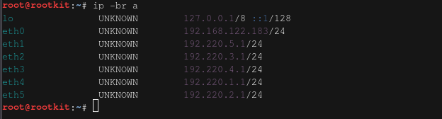

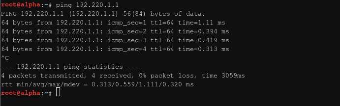

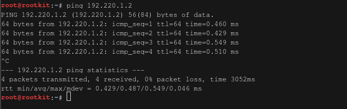

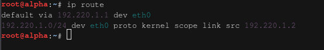

---

### Soal 2

**Konfigurasi** (`scripts/soal_2.sh`, di rootkit):

```sh
ip link set eth0 up
ip addr add 192.168.122.221/24 dev eth0
ip route replace default via 192.168.122.1 dev eth0
echo "nameserver 192.168.122.1" > /etc/resolv.conf

# IP forwarding
echo 1 > /proc/sys/net/ipv4/ip_forward
echo 'net.ipv4.ip_forward=1' >> /etc/sysctl.conf

iptables -t nat -A POSTROUTING -s 192.220.0.0/16 -o eth0 -j MASQUERADE
```

Rule `iptables` diberi `-C` check agar idempotent saat dijalankan ulang.

**Validasi:** 
```bash
ping 8.8.8.8
```
dari setiap node, termasuk rootkit.

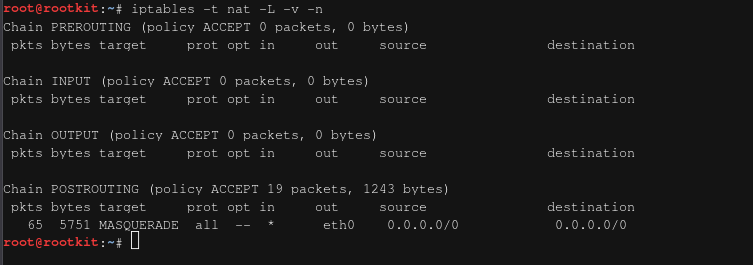

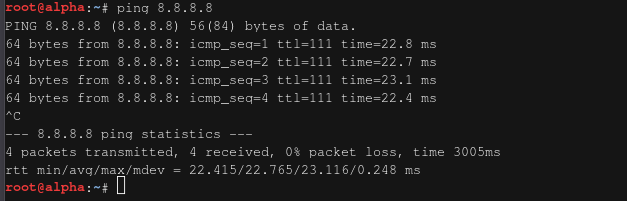

---

### Soal 3

**Konfigurasi:** forwarding antar segmen diaktifkan pada Soal 2 (`net.ipv4.ip_forward=1`). Resolver awal ditambahkan di `/etc/resolv.conf` semua host non-router (`scripts/soal_3.sh`):

```sh
echo 'nameserver 192.168.122.1' > /etc/resolv.conf
```

**Validasi:**

dari alpha
```bash
ping -c 3 192.220.5.7
```

dari molly
```bash
ping -c 3 192.220.1.2
```

lalu dari client
```bash
ping -c 3 google.com
```

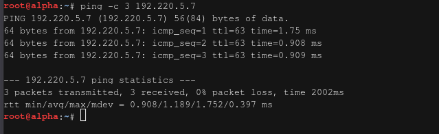

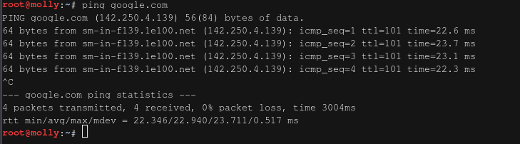

---

### Soal 4

**Konfigurasi prab (ns1)** (`scripts/soal_4_prab.sh`):

```sh
apt-get update && apt-get install -y bind9 bind9-utils bind9-dnsutils
```

```
# /etc/bind/named.conf.options
options {
        directory "/var/cache/bind";
        forwarders { 192.168.122.1; };
        dnssec-validation no;
        listen-on { any; };
        allow-query { any; };
        recursion yes;
};
```

```
# /etc/bind/named.conf.local
zone "k18.com" {
        type master;
        file "/etc/bind/db.k18.com";
        allow-transfer { 192.220.5.3; };
        notify yes;
        also-notify { 192.220.5.3; };
};
```

```
# /etc/bind/db.k18.com
$TTL    604800
@       IN      SOA     prab.k18.com. root.k18.com. (
                        2026092901      ; Serial (YYYYMMDDnn)
                        604800          ; Refresh
                        86400           ; Retry
                        2419200         ; Expire
                        604800 )        ; Negative Cache TTL
;
@       IN      NS      prab.k18.com.
@       IN      NS      tedd.k18.com.
prab    IN      A       192.220.5.2
tedd    IN      A       192.220.5.3
@       IN      A       192.220.4.2     ; apex -> gerbang aplikasi dinamis (penny)
```

named dinyalakan manual `named -u bind` - trixie tidak menyediakan init script bind9.

**Konfigurasi tedd (ns2)** (`scripts/soal_4_tedd.sh`):

```
# /etc/bind/named.conf.local
zone "k18.com" {
        type slave;
        masters { 192.220.5.2; };
        file "/var/lib/bind/db.k18.com";
};
```

**Konfigurasi resolver** (semua host non-router, `scripts/soal_4_resolver.sh`):

```sh
echo "nameserver 192.220.5.2
nameserver 192.220.5.3
nameserver 192.168.122.1" > /etc/resolv.conf
```

**Validasi:**

- `named-checkzone k18.com /etc/bind/db.k18.com` → OK.
- Transfer sukses: `/var/lib/bind/` di tedd memuat `db.k18.com`.
- `dig @192.220.5.2 k18.com SOA +short` dan dari tedd → serial sama (`2026092901`).
- `dig ... | grep flags` → `aa`; `ping k18.com` dari klien → 192.220.4.2.

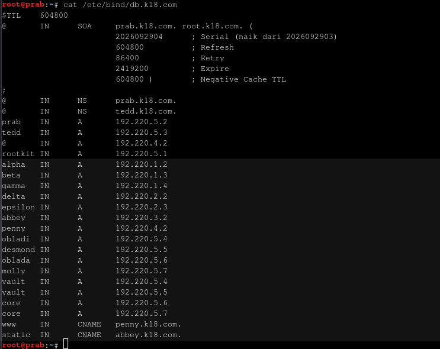

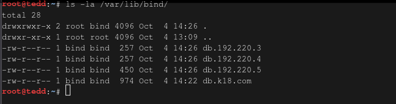

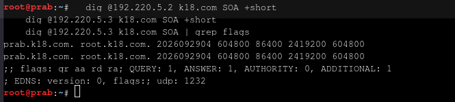

---

### Soal 5

**Konfigurasi** (`scripts/soal_5_hostname.sh` di tiap node; `scripts/soal_5_zone.sh` di prab):

- Hostname di-set runtime + `/etc/hostname`, dikenali system-wide via entry `/etc/hosts`: `<IP> <nama>.k18.com <nama>` - verifikasi `hostname -f` mengembalikan FQDN.
- Zona diperbarui dengan A record seluruh node; **prab & tedd dikecualikan** karena NS + A mereka sudah berdiri sejak Soal 4. Serial naik ke `2026092902`.

```
rootkit IN      A       192.220.5.1
alpha   IN      A       192.220.1.2
beta    IN      A       192.220.1.3
gamma   IN      A       192.220.1.4
delta   IN      A       192.220.2.2
epsilon IN      A       192.220.2.3
abbey   IN      A       192.220.3.2
penny   IN      A       192.220.4.2
obladi  IN      A       192.220.5.4
desmond IN      A       192.220.5.5
oblada  IN      A       192.220.5.6
molly   IN      A       192.220.5.7
```

**Validasi:** `hostname -f` → `alpha.k18.com` (dst.); `dig @192.220.5.2 alpha.k18.com +short` dan dari tedd menghasilkan IP sama; `ping molly.k18.com` dari klien.

di tiap client
```bash
hostname -f
```

dari prab dan tedd
```bash
dig @192.220.5.2 alpha.k18.com +short
```

dari client selain molly
```bash
ping molly.k18.com
```

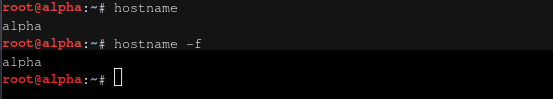

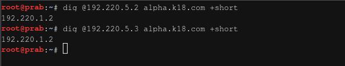

---

### Soal 6

**Konfigurasi** (`scripts/soal_6.sh`): serial SOA di prab dinaikkan ke `2026092903` - `notify` memicu tedd menarik zona terbaru secara otomatis.

**Validasi:**

```sh
dig @192.220.5.2 k18.com SOA +short   # prab (ns1)
dig @192.220.5.3 k18.com SOA +short   # tedd (ns2)
dig @192.220.5.3 alpha.k18.com A | grep flags   # harus ada 'aa'
```

Serial kedua server identik (`2026092903`) - tedd menjawab authoritative dari salinannya sendiri.

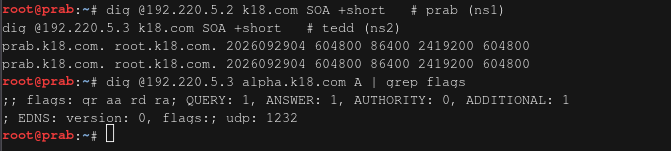

---

### Soal 7

**Konfigurasi** (`scripts/soal_7.sh`, di prab): zona diperbarui dengan

```
vault   IN      A       192.220.5.4
vault   IN      A       192.220.5.5
core    IN      A       192.220.5.6
core    IN      A       192.220.5.7
www     IN      CNAME   penny.k18.com.
static  IN      CNAME   abbey.k18.com.
```

Serial naik ke `2026092904`, tedd ikut tersinkron.

```bash
dig @192.220.5.2 vault.k18.com A +short
```
akan menghasilkan 2 ip, yaitu 5.4 dan 5.5

```bash
dig @192.220.5.2 www.k18.com A +short
```
akan menghasilkan 192.220.4.2

```bash
dig @192.220.5.2 static.k18.com A +short
```
akan menghasilkan 192.220.3.2

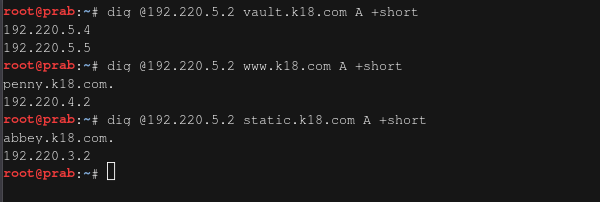

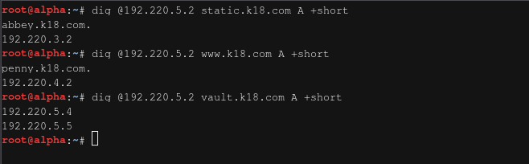

---

### Soal 8

**Konfigurasi** (`scripts/soal_8_prab.sh`, `scripts/soal_8_tedd.sh`): tiga reverse zone — `3.220.192.in-addr.arpa` (abbey), `4.220.192.in-addr.arpa` (penny), `5.220.192.in-addr.arpa` (vault: obladi/desmond + core: oblada/molly - satu subnet). Master di prab (notify + allow-transfer ke tedd), slave di tedd. Zone transfer hanya menyalin data zona, sehingga deklarasi `type slave` tetap ditulis di konfigurasi tedd.

```
# db.192.220.3                 # db.192.220.4                # db.192.220.5
2  IN  PTR  abbey.k18.com.     2  IN  PTR  penny.k18.com.    4  IN  PTR  obladi.k18.com.
                                                              5  IN  PTR  desmond.k18.com.
                                                              6  IN  PTR  oblada.k18.com.
                                                              7  IN  PTR  molly.k18.com.
```

**Validasi:**

```sh
dig -x 192.220.3.2 @192.220.5.2 +short   # abbey.k18.com.
dig -x 192.220.4.2 @192.220.5.3 +short   # penny.k18.com.
dig -x 192.220.5.7 @192.220.5.3 +short   # molly.k18.com.
dig -x 192.220.5.7 @192.220.5.3 | grep flags   # 'aa'
```

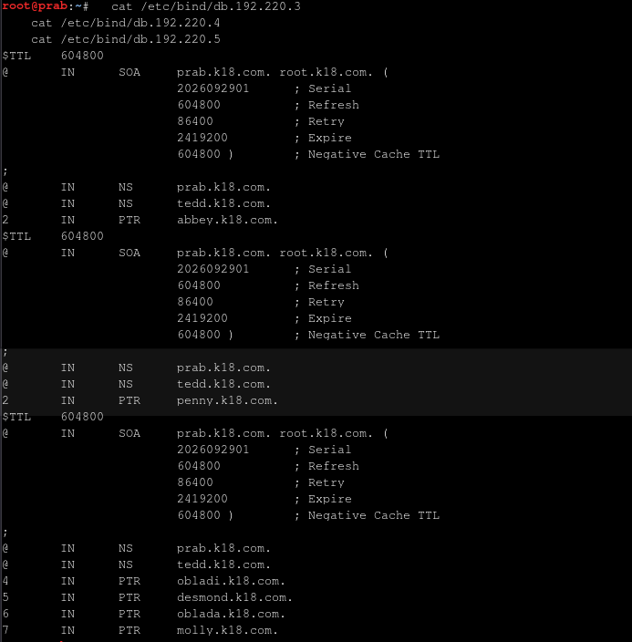

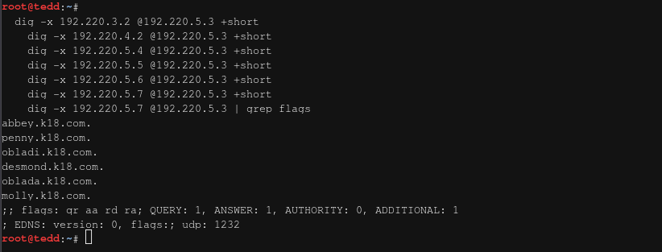

---

### Soal 9

**Konfigurasi** (`scripts/soal_9.sh`, di **obladi dan desmond**):

```sh
apt-get install -y apache2
mkdir -p /var/www/html/arsip    # + file contoh
```

```
# /etc/apache2/conf-available/arsip.conf
<Directory /var/www/html/arsip>
        Options +Indexes
        Require all granted
</Directory>
```

```sh
a2enconf arsip
apache2ctl start    # idempotent (graceful reload bila sudah jalan)
```

**Validasi:** akses via **hostname** dari node lain:

```sh
wget -O- http://obladi.k18.com/arsip/
wget -O- http://desmond.k18.com/arsip/
```

Hasil: halaman `Index of /arsip` berisi daftar file — autoindex aktif; footer Apache menyatakan nama server per node.

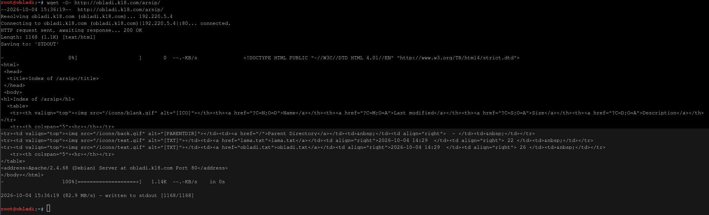

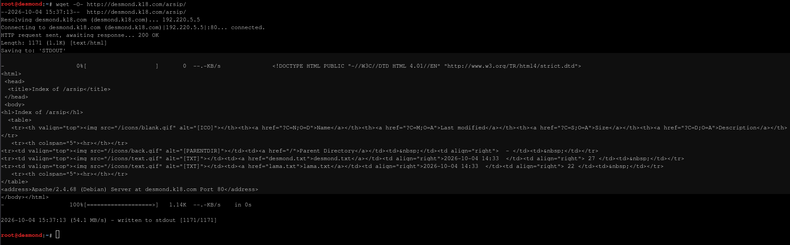

---

### Soal 10

**Konfigurasi** (`scripts/soal_10.sh`, di **oblada dan molly**):

```sh
apt-get install -y nginx php-fpm     # PHP 8.4 sesuai anjuran modul
```

Aplikasi: `/var/www/html/index.html` (beranda) + `profil.php` (mencetak `gethostname()` dan `phpversion()` sebagai bukti eksekusi dinamis).

```
# /etc/nginx/sites-available/default
server {
        listen 80 default_server;
        root /var/www/html;
        index index.html index.php;

        location / {
                try_files $uri $uri/ =404;
        }

        location = /profil {
                rewrite ^ /profil.php last;      # URL bersih
        }

        location ~ \.php$ {
                include snippets/fastcgi-php.conf;
                fastcgi_pass unix:/run/php/php8.4-fpm.sock;
        }
}
```

nginx dan `php-fpm8.4` dinyalakan manual (idempotent via `pgrep`).

**Validasi:** dari host lain via hostname:

```sh
wget -O- http://oblada.k18.com/          # beranda
wget -O- http://oblada.k18.com/profil    # "Profil oblada ... PHP 8.4.26 via PHP-FPM"
wget -O- http://molly.k18.com/profil     # "Profil molly ..."
```

Konten profil berbeda per node padahal script PHP-nya sama - bukti `/profil` ter-rewrite dan dieksekusi PHP-FPM.

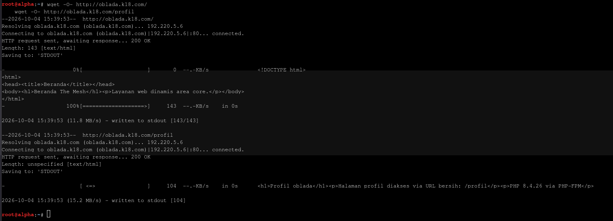

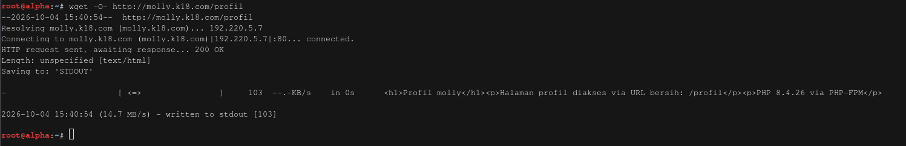

---

### Soal 11 — Reverse Proxy & Load Balancer Abbey (`soal_11_ab.sh`, di abbey)

- **abbey**: Menggunakan Nginx sebagai reverse proxy yang mengarahkan lalu lintas domain `static.k18.com` ke *Area Core* (`core_backend` yang berisi IP Oblada `192.220.5.6:80` dan Molly `192.220.5.7:80`).
- Menambahkan header `Host`, `X-Real-IP`, dan `X-Forwarded-For` pada blok proxy agar IP asli client diteruskan.
- **Verifikasi**: `nginx -t` OK, pengujian dari client `curl -H "Host: static.k18.com" http://192.220.3.2/profil` berhasil menampilkan respon dinamis dari node backend.

---

### Soal 12 — Basic Authentication path `/admin` (`soal_12.sh`, di penny)

- **penny**: Membuat file kredensial `/etc/apache2/.htpasswd` menggunakan `htpasswd` berisi username `prabs` dan password `pakar_pinter_jadi_goblok`.
- Menambahkan konfigurasi `<Location "/admin">` di Apache dengan `AuthType Basic` serta mematikan proxy pass khusus path tersebut (`ProxyPass !`).
- **Verifikasi**: `curl -i http://www.k18.com/admin` mengembalikan status `401 Unauthorized`. Pengaksesan dengan `curl -u prabs:pakar_pinter_jadi_goblok http://www.k18.com/admin` mengembalikan status `200 OK`.

---

### Soal 13 — Canonical Redirect (`soal_13.sh` di penny, `soal_13_ab.sh` di abbey)

- **penny**: Konfigurasi VirtualHost Apache untuk `penny.k18.com` dan IP `192.220.4.2` menggunakan `RewriteRule` dengan flag `[R=301,L]` yang memaksa redirect permanen ke `http://www.k18.com`.
- **abbey**: Konfigurasi server block Nginx untuk `abbey.k18.com` dan IP `192.220.3.2` yang mengembalikan `return 302 http://static.k18.com$request_uri;` (redirect sementara).
- **Verifikasi**: Uji `curl -I http://192.220.4.2` mengembalikan `HTTP/1.1 301 Moved Permanently`, sedangkan `curl -I http://192.220.3.2` mengembalikan `HTTP/1.1 302 Moved Temporarily`.

---

### Soal 14 — Pencatatan Real Client IP di Log Backend (`soal_14_obladi.sh` di vault, `soal_14_oblada.sh` di core)

- **vault (obladi & desmond)**: Mengaktifkan modul `mod_remoteip` Apache, menentukan header `RemoteIPHeader X-Real-IP`, mendaftarkan IP proxy `192.220.4.0/24` sebagai trusted proxy, serta mengubah format LogFormat dari `%h` ke `%a`.
- **core (oblada & molly)**: Menambahkan modul `set_real_ip_from` Nginx yang menunjuk ke IP/subnet proxy Abbey (`192.220.3.0/24`) dan menentukan `real_ip_header X-Real-IP;`.
- **Verifikasi**: Melakukan request dari host client `alpha` (`192.220.1.2`) melalui proxy, lalu memeriksa `/var/log/apache2/access.log` di vault dan `/var/log/nginx/access.log` di core. Log mencatat `192.220.1.2`, bukan IP proxy.

---

### Soal 15 — Dedicated Path `/eternal` & `/orion` (`soal_15.sh` di penny, `soal_15_ab.sh` di abbey)

- **penny**: Membuat path lokal `/var/www/eternal` yang mengeksekusi script PHP melalui PHP-FPM socket/FastCGI proxy (`proxy:unix:...|fcgi://localhost/`), serta menambahkan `ProxyPass !` agar tidak di-forward ke backend.
- **abbey**: Membuat path lokal `/var/www/orion` yang menyajikan file statis `index.html` murni tanpa eksekusi PHP melalui directive `alias /var/www/orion/;` di Nginx.
- **Verifikasi**: Uji `curl http://www.k18.com/eternal/` berhasil merender "PHP Rendering: ACTIVE". Uji `curl http://static.k18.com/orion/` menampilkan halaman statis HTML.

---

### Soal 16 — Stress Test Benchmark dengan ApacheBench (`soal_16.sh`, dari client Alpha)

- Menginstal `apache2-utils` pada client `alpha`.
- Menjalankan perintah pengujian:
  - `ab -n 250 -c 10 http://www.k18.com/` (menguji Penny → Vault).
  - `ab -n 250 -c 10 http://static.k18.com/` (menguji Abbey → Core).
- **Verifikasi**: Rangkuman log tersimpan di `/tmp/ab_penny.log` dan `/tmp/ab_abbey.log`, menunjukkan total 250 requests selesai diselesaikan (0 failed requests) dengan metrik *Requests per second* yang tercatat.

---

### Soal 17 — DNS TXT Record Klien Sayap Kiri & Kanan (`soal_17.sh`, di prab)

- Mengedit file zona `/etc/bind/db.k18.com` di `prab` untuk menambahkan TXT record pada kelima node client: `alpha`, `beta`, `gamma`, `delta`, dan `epsilon` yang mengembalikan nama host masing-masing (misal: `alpha IN TXT "alpha"`).
- Menaikkan serial SOA di prab untuk memicu sinkronisasi ke slave `tedd`.
- **Verifikasi**: Perintah `dig @127.0.0.1 alpha.k18.com TXT +short` mengembalikan respon `"alpha"`.

---

### Soal 18 — Simulasi Perubahan A Record & TTL 15s (`soal_18.sh`, di prab)

- Mengubah A record `abbey.k18.com` pada zone file di prab menjadi IP fiktif `10.99.99.99` dengan TTL 15 detik (`abbey 15 IN A 10.99.99.99`) dan menaikkan serial SOA.
- **Uji 3 Fase**:
  1. *Sebelum perubahan*: Query mengembalikan IP lama (`192.220.3.2`).
  2. *Sesaat setelah perubahan (< 15 detik)*: Query masih mengembalikan IP lama karena respon tersimpan di cache DNS.
  3. *Setelah TTL habis (> 15 detik)*: Query berhasil memperbarui cache dan mengembalikan IP fiktif baru (`10.99.99.99`).
- **Restorasi**: Koordinat A record `abbey` dikembalikan ke IP normal (`192.220.3.2`) dan serial SOA dinaikkan kembali.

---

### Soal 19 — CNAME Internal ke External BadSSL (`soal_19.sh`, di prab)

- Menambahkan record CNAME pada file zona `/etc/bind/db.k18.com`: `outbound IN CNAME http.badssl.com.`
- Menaikkan serial SOA dan memuat ulang service BIND (`named`).
- **Verifikasi**: `dig @127.0.0.1 outbound.k18.com +short` mengembalikan `http.badssl.com.`. `curl -sL http://outbound.k18.com` dari client berhasil menampilkan isi konten dari halaman BadSSL.

---

### Soal 20 — Persistence & Autostart Configuration (`soal_20*.sh`, di seluruh node)

- Memastikan semua service, script pengalamatan, dan routing dapat berjalan kembali secara otomatis saat container/node di-restart:
  - **rootkit (`soal_20_rootkit.sh`)**: Mengaktifkan IP forwarding (`net.ipv4.ip_forward=1`) dan aturan NAT MASQUERADE.
  - **prab & tedd (`soal_20_tedd.sh`)**: Memastikan direktori `/run/named` dibuat dengan *ownership* `bind:bind` dan daemon `named` berjalan.
  - **penny & abbey (`soal_20.sh`)**: Memastikan service Apache2, Nginx, dan PHP-FPM aktif.
  - **vault & core (`soal_20_oblida.sh`, `soal_20_oblada.sh`)**: Memastikan daemon Nginx, Apache2, dan PHP-FPM berjalan.
  - **client (`soal_20_alpha.sh`, `soal_20_beta.sh`)**: Memastikan urutan resolver `/etc/resolv.conf` tetap mengarah ke `192.220.5.2` (prab), `192.220.5.3` (tedd), lalu `192.168.122.1`.
